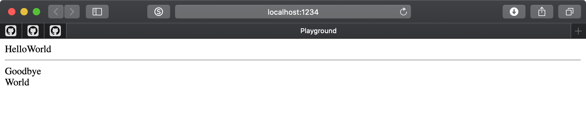

# layout-styled-components

This project simplify uses `horizontal`, `grid`,`vertical` and `space` styled-components.

## Example

See [example/index.tsx](./example/index.tsx).

```js
const App = () => {
  return (
    <div>
      <Horizontal>
        <div>Hello</div>
        <div>World</div>
      </Horizontal>

      <hr />

      <Vertical>
        <div>Goodbye</div>
        <div>World</div>
      </Vertical>
    </div>
  );
};
```

Produces:



## Running Example and Development

In root run `yarn install` then `yarn watch`.
Then `cd examples && yarn start` and see it in browser at `http://localhost:1234`.
